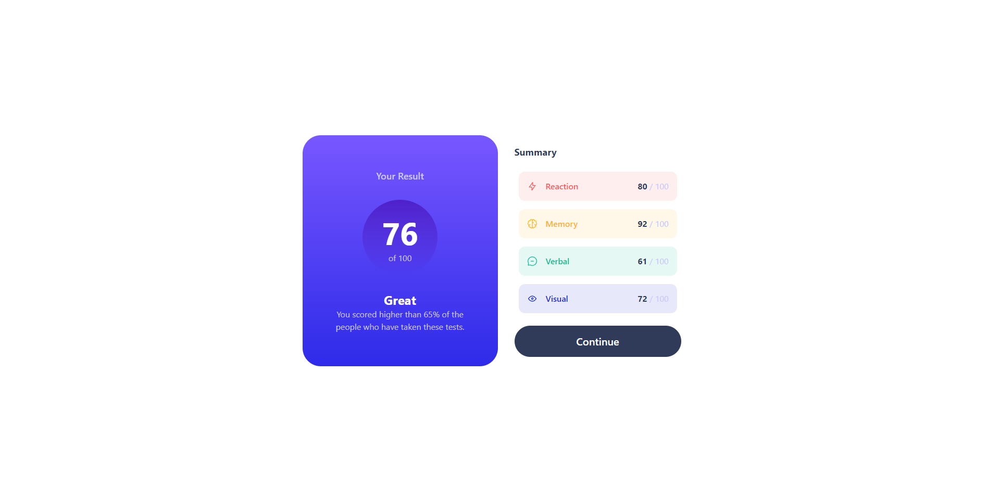

# Frontend Mentor - Results summary component solution

This is a solution to the [Results summary component challenge on Frontend Mentor](https://www.frontendmentor.io/challenges/results-summary-component-CE_K6s0maV). Frontend Mentor challenges help you improve your coding skills by building realistic projects.

## Table of contents

  - [The challenge](#the-challenge)
  - [Screenshot](#screenshot)
  - [Links](#links)
- [My process](#my-process)
  - [Built with](#built-with)
  - [What I learned](#what-i-learned)
- [Author](#author)

**Note: Delete this note and update the table of contents based on what sections you keep.**

### The challenge

Users should be able to:

- View the optimal layout for the interface depending on their device's screen size
- See hover and focus states for all interactive elements on the page
- **Bonus**: Use the local JSON data to dynamically populate the content

### Screenshot

### Links

- Solution URL: [https://github.com/Podziuu/Frontendmentor_Projects/tree/main/Results_summary_component](https://github.com/Podziuu/Frontendmentor_Projects/tree/main/Results_summary_component)
- Live Site URL: [https://64ef50a0d7549c0ae425a419--gleaming-shortbread-231cb8.netlify.app/](https://64ef50a0d7549c0ae425a419--gleaming-shortbread-231cb8.netlify.app/)

## My process

I embarked on this project with a deliberate sequence, commencing with the creation of a mobile-centric site that prioritized seamless functionality on smaller screens. With this solid foundation in place, I seamlessly transitioned to enhancing the user experience through the integration of a desktop design. This dual-pronged approach ensures that regardless of the user's device, the site maintains its appeal and usability.

However, my pursuit of excellence didn't conclude there. To truly elevate the project, I delved into the realm of animations. By strategically incorporating animations, I breathed life into various elements of the site. Subtle yet captivating animations were employed to engage users and provide a dynamic visual experience. These animations, carefully woven into the fabric of the design, inject an element of delight and interactivity, elevating the project beyond mere static aesthetics.

In essence, my journey encompassed meticulous steps: from establishing a solid mobile foundation to seamlessly accommodating desktop interfaces, and finally, to infusing the project with captivating animations. This holistic approach not only reflects my commitment to user-centric design but also showcases my ability to orchestrate a harmonious fusion of design, functionality, and engagement.
### Built with

- React
- Tailwind
- Flexbox
- Mobile-first workflow

### What I learned

I revise my knowledge with this project

## Author

- Website - [Bartosz Podemski](https://bartoszpodemski.me/)
- Frontend Mentor - [@Podziuu](https://www.frontendmentor.io/profile/podziuu)
- Twitter - [@Podziuu](https://www.twitter.com/podziuu)